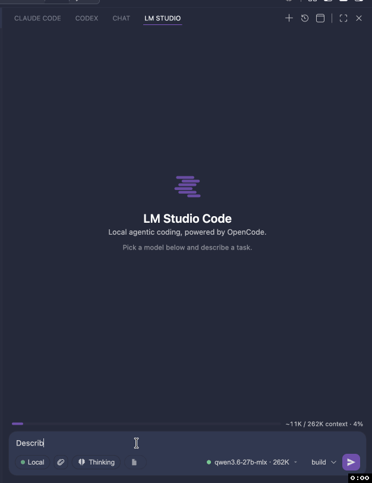

# LM Studio Code

**A real coding agent in VS Code — running entirely on the models you already have in LM Studio.**

Not autocomplete. This is a full agent panel: it reads and edits your files, runs shell commands, asks permission before it touches anything, works through a todo list, and keeps going until the job is done. Everything runs on your machine against [LM Studio](https://lmstudio.ai) — no cloud round-trip, no API key, no token bill, works on a plane.

Powered by the open-source [**OpenCode**](https://opencode.ai) agent, bundled right in. Install, pick a model, start working.

## Demo



---

## The agent

- **Real tools** — reads files, writes edits, runs shell commands, searches your codebase. Every step shows up as a tool card you can expand.
- **You stay in control** — inline permission prompts on every action: *Allow once*, *Allow always*, or *Deny*.
- **Build or plan mode** — `build` edits your code; `plan` is strictly read-only for when you just want a strategy.
- **Live todo list** — the agent's plan renders as a checklist that ticks off in place as it works, with a progress count.
- **See it think** — reasoning models get collapsible *Thinking* blocks. Alt-click the thinking pill to hide them without changing how the model works.
- **Dial the thinking** — set reasoning effort per model from the model menu, the composer pill, or `/effort`. The levels offered are the ones the model actually reports: most local reasoning models are on/off, so you get *Auto · Off · On* rather than a low/medium/high slider that would do nothing. Models with no reasoning support hide the control entirely.
- **Streaming everything** — responses render as markdown with syntax-highlighted code as they arrive.

## Agents — specialists you define

- **Bring your own agent** — drop a `.opencode/agent/<name>.md` in your workspace (YAML frontmatter + a body that becomes its system prompt) and it shows up in the agent picker. Each agent can pin its own model, restrict which tools it may use, and set its own reasoning effort.
- **`mode` decides who reaches it** — `primary` puts it in your picker; `subagent` keeps it out of the picker and lets *the model* delegate to it through the built-in task tool when your request matches its `description`; `all` does both.
- **Delegation saves context, it doesn't spend it** — a subagent runs in its own session with its own context window and returns only its answer, so a long search doesn't fill up the conversation you're having.
- **`/agents`** shows both halves — what you can select, and what the model can delegate to. **`/agents new <name>`** scaffolds a definition and opens it.
- Heads up: new agents are picked up when the OpenCode server restarts, and delegation depends on your local model reliably calling tools — smaller models may just answer directly instead.

## Goals — point it at an objective and walk away

- **`/goal <objective>`** starts an autonomous loop. After each turn, an isolated judge — running on *your* local model — decides whether the goal is actually met. If it isn't, the agent continues with specific feedback about what's still missing.
- **A pinned goal bar** tracks the objective, round count, and elapsed time, with edit / pause / resume / clear controls.
- **It can't run away** — a 25-round cap plus stall detection that pauses the loop and tells you why when progress flatlines.
- **It listens** — change your mind mid-goal and it notices, offering a one-click *Update goal* instead of chasing a stale target.

## Steer it mid-flight

Type while the agent is working and hit Enter — your instructions get injected at its next step, so it adjusts work already in progress instead of you stopping and starting over. The stop button still stops.

## Your models, your machine

- **Live model picker** — every model in LM Studio, showing loaded ● / unloaded ○, context size, publisher, format (MLX/GGUF), and quantization, so same-named models are never ambiguous. Load or eject right from the menu.
- **Context handled for you** — the extension reloads your model with an adequate context window via the `lms` CLI, so a 4096-token default never blows up mid-task.
- **Room to think** — the output budget scales with the context window (up to 32k), so long reasoning doesn't get chopped off mid-answer. If a response does hit the ceiling, you're told.
- **Multiple servers** — register several LM Studio instances, local or remote, and switch between them in a click.
- **Per-server API keys** — connect to remote instances behind authentication. Keys live in VS Code's encrypted Secret Storage: never in a settings file, never sent back to the UI, never inherited by tool processes the agent spawns.
- **Quiet by default** — a 30-second liveness check shared across panels, paused when hidden. Your LM Studio log stays readable, and a busy server no longer flashes "offline" mid-generation.

## Context, without the busywork

- **Highlight to share** — select code in any file and it's automatically attached to your next message, exact lines and range included. No pill to manage, no setup.
- **`/file`** toggles the open file as context.
- **Paste images** — screenshots and mockups attach as labelled chips with dimensions; click for a full-size lightbox.
- **`/compact`** summarizes the conversation to reclaim context when you're running low, and shows you the summary it produced.
- **A context meter** above the composer so you always know where you stand.

## Sessions that survive

- **Auto-restored** — reopen VS Code and your last conversation is right where you left it, per workspace.
- **Full history** — browse, resume, rename, and delete past sessions. Empty chats never clutter the list.
- **Work in parallel** — *Open in Editor Tab* gives a conversation its own tab, so you can run several at once.

## Extend it — MCP servers and skills

- **MCP tools** — browser automation, databases, issue trackers, docs. Local (stdio) and remote (http/sse) servers both work, and their tools get the same tool cards and permission prompts as built-ins.
- **Nothing to re-enter** — the `.mcp.json` you already wrote for **Claude Code** and the `.vscode/mcp.json` you wrote for **VS Code** are discovered automatically.
- **`/mcp`** shows live status per server: 🟢 connected, 🟡 disabled, 🔴 failed with the reason. A broken server never blocks your chat.
- **`/skills`** lists the skills available to the model with their source (project / global / built-in) and path — your `.opencode/skill` and `.claude/skills` are picked up too.
- **Slash commands** — type `/` for a filterable menu: `/clear`, `/compact`, `/file`, `/mcp`, `/skills`, `/goal`, `/help`, plus your own skills and OpenCode commands, with arguments.

## Fits your window

The panel lives in the Activity Bar (or the secondary side bar), and the composer adapts to narrow layouts — lower-priority controls tuck into a ⋯ menu instead of getting pushed off-screen.

---

## Quick start

1. Start LM Studio's server and load a model.
2. Install this extension.
3. Click the spark icon in the Activity Bar.
4. Pick a model, type a task, hit Enter.

### Requirements

- **VS Code** 1.104+
- **[LM Studio](https://lmstudio.ai)** running with its local server started (default `http://127.0.0.1:1234`) and at least one chat model
- *(recommended)* the **`lms` CLI** for automatic context-window management

> **[OpenCode](https://opencode.ai) is bundled** — the matching platform binary ships inside the extension, so there's nothing extra to install and it works offline. Power users can point at their own build with `lmstudioCode.opencodePath`; an install on your `PATH` or in `~/.opencode/bin` is preferred over the bundled copy if present.

### Beta channel

New features ship to the Marketplace **pre-release** channel first (odd minor
versions, e.g. `0.13.x`; stable releases use even minors). To try betas, open
the extension's Marketplace page in VS Code and click **Switch to Pre-Release
Version** — VS Code updates you along the beta track and you can switch back
any time with **Switch to Release Version**.

## Settings

| Setting | Default | Description |
| --- | --- | --- |
| `lmstudioCode.lmStudioBaseUrl` | `http://127.0.0.1:1234/v1` | LM Studio OpenAI-compatible base URL |
| `lmstudioCode.opencodePath` | _(bundled)_ | Override path to an `opencode` binary; empty uses your own install (PATH / `~/.opencode`) or the bundled one |
| `lmstudioCode.serverPort` | `0` | Embedded server port (0 = auto) |
| `lmstudioCode.defaultModel` | _(first)_ | Default model id |
| `lmstudioCode.agent` | `build` | `build` or `plan` |
| `lmstudioCode.autoEnsureContext` | `true` | Reload model with adequate context before prompting |
| `lmstudioCode.minContextLength` | `32768` | Context length to (re)load with |
| `lmstudioCode.defaultThinkingEffort` | `auto` | Starting reasoning effort (`auto`/`off`/`low`/`medium`/`high`) for models you haven't set one for |
| `lmstudioCode.gpuOffload` | `max` | GPU offload for `lms load` |
| `lmstudioCode.healthCheckSeconds` | `30` | Health/model poll cadence while connected (5–600). Disconnected retries stay at 5s; the model list refreshes immediately while the model picker is open |
| `lmstudioCode.mcpServers` | `{}` | MCP servers to expose to the agent (in addition to auto-discovered ones) |

## MCP servers

The agent can call tools from [MCP (Model Context Protocol)](https://modelcontextprotocol.io) servers — browser automation, databases, issue trackers, docs, and more. OpenCode runs the servers; this extension just gathers them from wherever you've configured them and hands them over.

### Where servers come from

Servers are merged from these sources, in increasing precedence (a later source wins on a name collision):

| # | Source | Format | Top-level key |
| --- | --- | --- | --- |
| 1 | `.mcp.json` at your workspace root | **Claude Code** project format | `mcpServers` |
| 2 | `.vscode/mcp.json` in your workspace | **VS Code** workspace format | `servers` |
| 3 | VS Code's user-level `mcp` setting | **VS Code** user format | `servers` |
| 4 | `lmstudioCode.mcpServers` (VS Code settings) | bare map of name → server | _(the map itself)_ |

If you already use MCP with Claude Code or VS Code Copilot, those servers work here with **nothing to re-enter**. Use `lmstudioCode.mcpServers` to add a server just for LM Studio Code, or to override a discovered one.

### Setting up a `.mcp.json` (shareable, per project)

Create `.mcp.json` at your project root — the same file Claude Code uses, so it's safe to commit and share with your team:

```jsonc
{
  "mcpServers": {
    // local (stdio) server — runs a command, talks over stdin/stdout
    "playwright": {
      "command": "npx",
      "args": ["-y", "@playwright/mcp@latest"]
    },
    // local server with a working dir and env var
    "filesystem": {
      "command": "npx",
      "args": ["-y", "@modelcontextprotocol/server-filesystem", "."],
      "env": { "LOG_LEVEL": "info" }
    },
    // remote (http/sse) server, with a token pulled from the environment
    "docs": {
      "type": "http",
      "url": "https://example.com/mcp",
      "headers": { "Authorization": "Bearer ${MY_TOKEN}" }
    },
    // defined but off — won't be started
    "staging": {
      "command": "npx",
      "args": ["-y", "some-mcp-server"],
      "enabled": false
    }
  }
}
```

A `.vscode/mcp.json` is identical except the top-level key is `servers` instead of `mcpServers` (VS Code's convention) — both are supported.

### What's supported

| Field | Applies to | Notes |
| --- | --- | --- |
| `command` | local (stdio) | Executable name or path (e.g. `npx`, `uvx`, an absolute path). |
| `args` | local (stdio) | Array of arguments passed to `command`. |
| `env` | local (stdio) | Environment variables for the server process. |
| `type` | both | `"http"` / `"sse"` mark a remote server; `"stdio"` / `"local"` a local one. Inferred from the fields when omitted (a `url` ⇒ remote, a `command` ⇒ local). |
| `url` | remote (http/sse) | The server endpoint. |
| `headers` | remote (http/sse) | HTTP headers, e.g. an `Authorization` token. |
| `enabled` | both | Set `false` to keep a server defined but not started. |

- **`${VAR}` references** in `env` values, `headers`, and `url` are resolved from the environment before the server launches — keep secrets in your environment, not in the file.
- **Transports:** local (stdio) and remote (http/sse). Both the Claude Code field shape (`command` + `args`) and the VS Code shape are accepted and normalized for you.

### Checking status — the `/mcp` command

Type **`/mcp`** in the chat to list your configured servers and their live status:

- 🟢 **connected** — running and its tools are available
- 🟡 **disabled** — defined but `"enabled": false`
- 🔴 **failed** — couldn't start/connect; the reason is shown (a bad server never blocks the chat)

Each row shows the transport (local/remote) and the command or URL it was configured with.

### Notes

- **Applying changes.** Edits to `lmstudioCode.mcpServers` (or VS Code's `mcp` setting) restart the agent automatically. Edits to the `.mcp.json` / `.vscode/mcp.json` files apply on the next **LM Studio Code: Restart OpenCode Server** (or a window reload).
- **Mind the context window.** Each MCP server adds its tool schemas to every request. Local models have far less context than cloud ones (OpenCode's own system prompt + built-in tools already use ~11k tokens), so enable only the servers you need and raise `lmstudioCode.minContextLength` if tools start crowding out the conversation.
- **`npx`/`uvx` on `PATH`.** Local servers launched with `npx`/`uvx` need Node and those tools on `PATH`. The extension augments `PATH` with common install locations (Homebrew, `~/.local/bin`, nvm/fnm, bun, cargo), but if a server shows as **failed**, check **LM Studio Code: Show Logs**.

## How it works

```
VS Code webview (chat UI)
        │  postMessage
        ▼
Extension host (bridge)
        │  HTTP + SSE  (raw fetch)
        ▼
opencode serve   ──OpenAI /v1──▶  LM Studio (local model)
   (headless, config injected via OPENCODE_CONFIG_CONTENT)
```

The LM Studio provider is injected into OpenCode at launch via the
`OPENCODE_CONFIG_CONTENT` environment variable — **nothing is written to your
workspace or global config.** Discovered LM Studio models are declared in the
provider's `models` map (OpenCode requires this for custom OpenAI-compatible
providers).

## Develop from source

```bash
npm install
npm run bundle:opencode      # fetch the pinned OpenCode binary into bin/ for your platform
npm run compile              # type-check + bundle (extension + webview)
# then press F5 in VS Code to launch the Extension Development Host
npm run package:vsix:bundled # build a platform .vsix with the binary embedded
```

The OpenCode binary is fetched at build time (pinned by `opencodeVersion` in
`package.json`) and is never committed — `bin/` is git-ignored. Bump that field
to upgrade the bundled OpenCode. F5 also resolves the binary from `bin/`, so run
`bundle:opencode` once before launching the dev host.

## License

MIT
